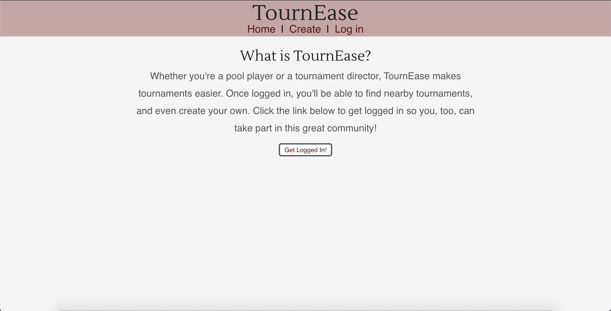
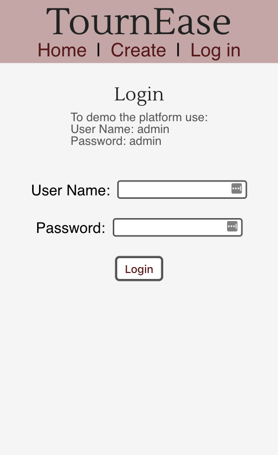
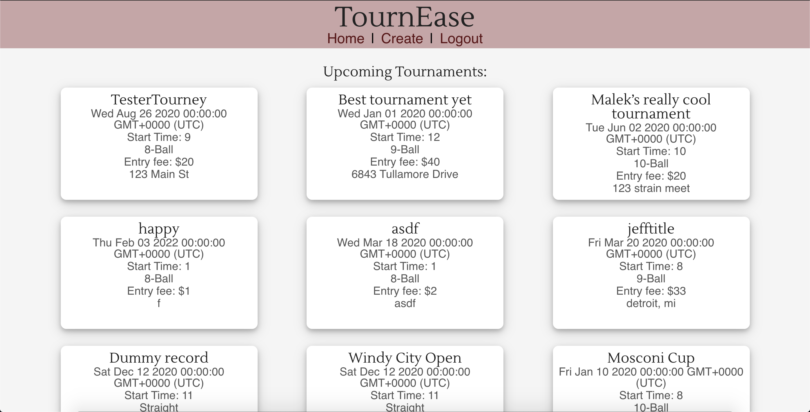
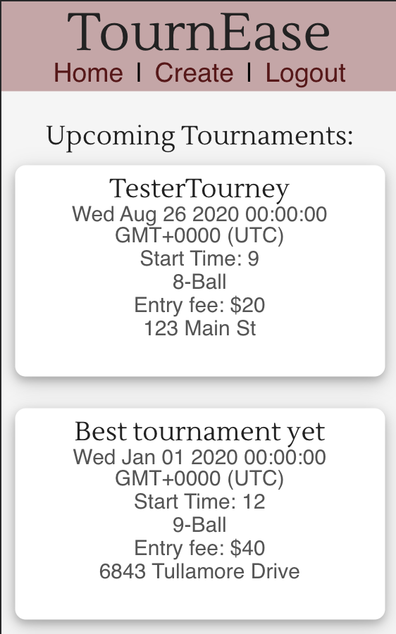
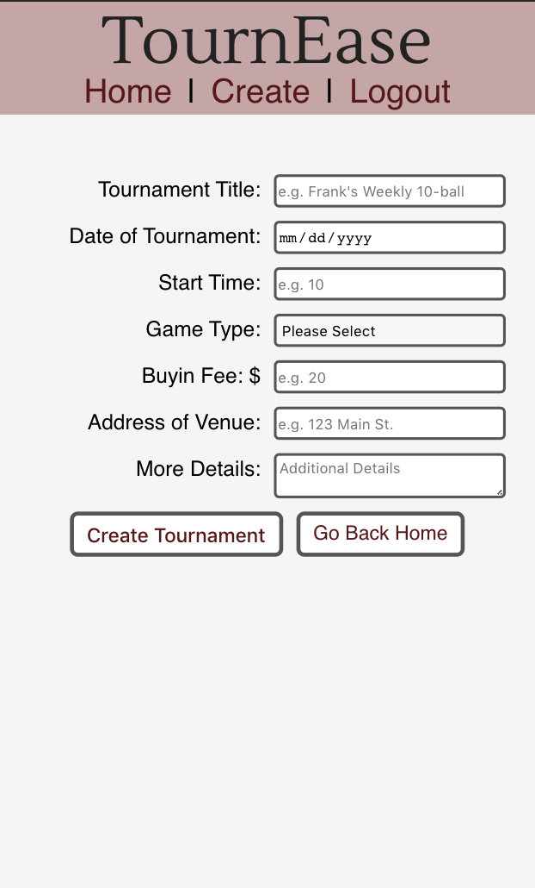

# App Name: TournEase

Author: [Malek Adair](https://github.com/malekadair)

---

Live app: [TournEase](https://tournease-client.malekadair.now.sh/)

## About TournEase

The project allows you to login as an admin, view upcoming tournaments, and post an upcoming tournament.

If not logged in, the main page displays a welcome section which explains the app and prompts you to login to get started.

Once logged in, the main page displays previously posted tournaments that are upcoming.

The Create route will take you to a form to post your own upcoming tournament. This controlled form includes 6 input values and a message textarea for the user to include additional details about the tournament.

After successfully submitting a tournament, you will be redirected back to the homescreen which should now be displaying your tournament as well as other upcoming tournaments.

## Application Features

## Screenshots

## Technologies used

#### Front-end technologies:

- Reactjs
- Javascript
- HTML5
- CSS3

#### Back-end technologies:

- Express.js
- Node.js
- PostgreSQL
- Node-fetch

## Links:

API Documentation: [TournEase API](https://github.com/malekadair/tournease-server)

## Setting Up

- Install dependencies: `npm install`

## Scripts

- Start the application for development: `npm start`
